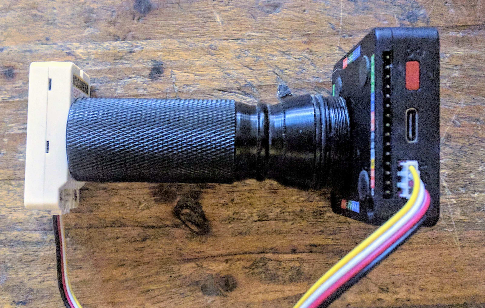
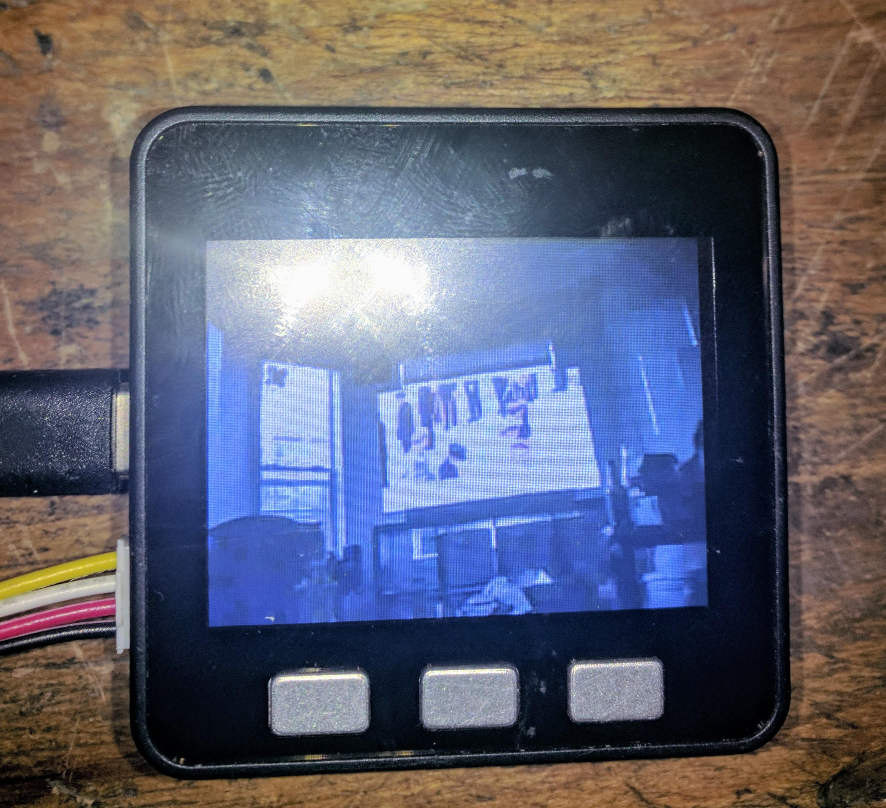

# m5-prop-gun-sight
Prop Gun Sight using M5 Core and M5-Camera-X or M5-Camera-F. Based originally on the M5Stack UART example, but is full-screen and has prop graphics. M5-Camera steaming over grove connector to M5-Core. Powered by M5-Core.

Arduino for the M5 Core Display.

Esp-idf for the M5-Camera module.

TO-DO
* build instructions for both Arduino and esp-idf.
* cross-hairs (added, but a hack for now)
* various displays (like wifi-scanning superimposed over image to look futuristic)
* button functions for brightness, etc.
* improve smoothness of display.
* dance like no one is watching.

